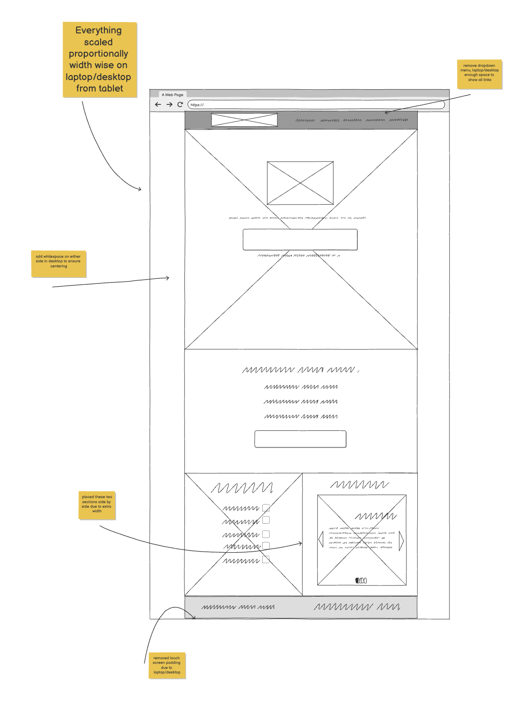
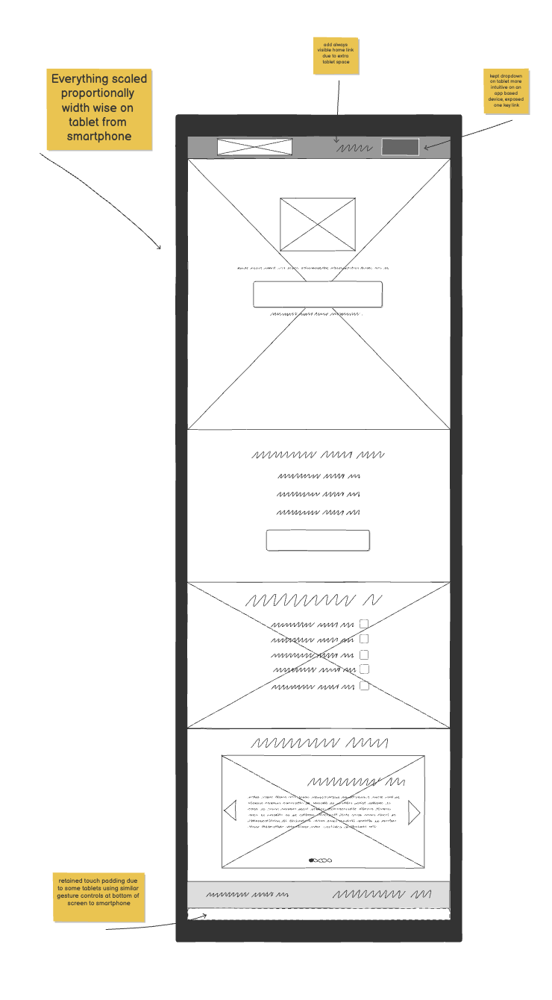
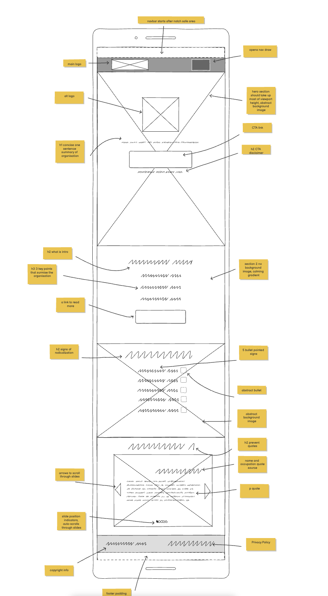
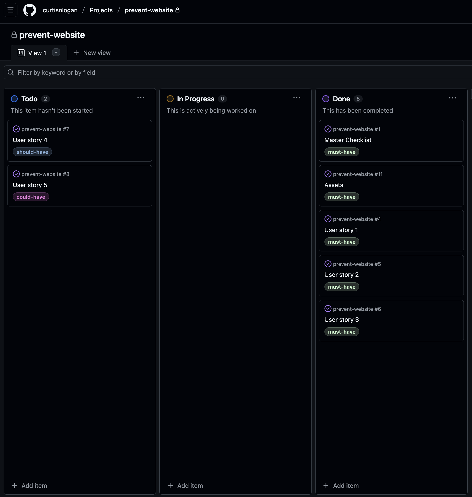
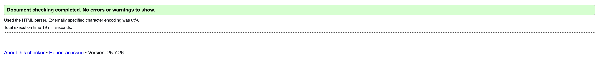
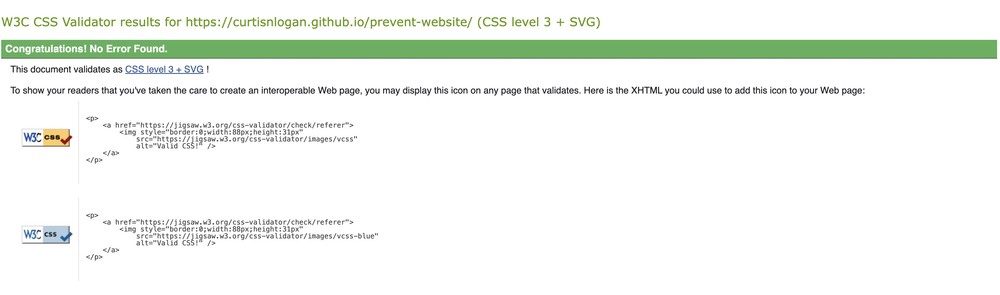

# prevent-website

A responsive educational website that helps users identify signs of radicalization and provides resources to report concerns about violent extremism.

**⏰ Time Constraint:** This project was completed under a strict 3-day time limit with no commits permitted after 5pm on the final cutoff day. The project has remained unmodified since submission to maintain academic integrity.

## Purpose

This website was created to raise awareness about the UK's Prevent strategy and educate the public on recognizing early warning signs of radicalization. The goal is to help vulnerable individuals avoid being lured into violent extremism by providing clear information about what to look for and how to take action when concerns arise.

Built with accessibility and performance in mind, the site implements semantic HTML5 structure, responsive Bootstrap 5 framework, and custom CSS with modern features including CSS custom properties, gradient backgrounds, and smooth hover transitions. The website includes comprehensive SEO optimization with meta descriptions and keywords focused on terrorism prevention and security awareness.

## User Value

This website educates visitors about radicalization warning signs through an interactive carousel showcasing five key behavioral indicators, while providing immediate access to official UK government reporting channels. Community members, educators, and family members can identify at-risk individuals and take swift action through emergency contacts and reporting mechanisms to potentially prevent acts of terrorism.

### Hero Section

The landing page features a clear call-to-action button linking to the official UK government terrorism reporting site, along with emergency contact information (999) prominently displayed. This immediate access to reporting mechanisms provides users with a direct path to take action on their concerns.

**Technical Implementation:** Custom CSS background positioning at `60% center` with cover scaling, fixed-top navigation with scroll-margin adjustments, and hover effects on desktop with smooth width transitions. The hero uses flexbox centering and implements a minimum height of 800px for consistent viewport coverage.

### What is Prevent Section

A visually organized breakdown of Prevent's three core functions using bullet points and contrasting colors. This section educates users about the strategy's approach to tackling terrorism ideology, early intervention, and rehabilitation, helping them understand the broader context of counter-extremism efforts.

**Technical Implementation:** CSS blend modes combining linear gradients with background images, custom styled bullet points using decorative PNG images, and responsive typography scaling from 0.9rem to 1.5rem across breakpoints.

### Signs of Radicalization Carousel

An interactive Bootstrap carousel displaying five key warning signs with background imagery and detailed descriptions. Each slide covers specific behaviors like glorifying violence, identity transformation, social isolation, dehumanizing language, and fixation on grievances, giving users concrete examples to recognize in their communities.

**Technical Implementation:** Bootstrap 5 carousel component with custom CSS overlay captions using RGBA background colors for readability (0.8-0.9 opacity). The carousel is responsive with max-width constraints (400px mobile, 600px desktop) and center-aligned using auto margins. Typography scales responsively across breakpoints, with rounded corners on caption backgrounds for visual polish.

### Responsive Navigation

A mobile-first navigation system with special consideration for tablet users (exposed home link).

**Technical Implementation:** Bootstrap navbar with custom breakpoint logic - the home link is hidden on tablets (`d-md-none d-lg-block`) but exposed separately for tablet users (`d-none d-md-block d-lg-none`) positioned with margin-left offset. The navbar uses gradient backgrounds with font weight and border radius customizations that override Bootstrap defaults for brand consistency.

## Design Process

### Wireframing

This was my first time creating wireframes, and while I ended up deviating slightly from the original designs during development, they proved invaluable for the overall design process. The wireframes helped me avoid getting bogged down in design decisions while styling, allowing me to focus on implementation rather than constantly reconsidering the general layout and structure.

**Desktop Wireframe:**


**Tablet Wireframe:**


**Mobile Wireframe:**


The wireframes established the core layout principles that guided development: hero section with prominent CTA, clear information hierarchy in the Prevent explanation, carousel-based presentation of warning signs, and responsive navigation patterns. Having these foundational decisions mapped out beforehand streamlined the development process significantly.

## Project Management

### MoSCoW Prioritization



The project followed MoSCoW prioritization methodology to ensure delivery of a polished MVP within the 3-day time constraint. Two lower-priority "Could Have" tasks were intentionally left undone in favor of focusing development effort on core functionality and polish. This approach prioritized having a fully functional, well-designed website over adding potentially fiddly additional features that might compromise the overall quality of the deliverable.

The GitHub Projects board tracked progress through Must Have, Should Have, Could Have, and Won't Have categories, ensuring clear focus on essential features while maintaining visibility of future enhancement opportunities.

## Validation

### HTML Validation



The website passes W3C HTML validation, ensuring clean, semantic markup that follows web standards and promotes accessibility. The HTML structure includes proper semantic elements (`<header>`, `<main>`, `<section>`, `<footer>`), comprehensive ARIA labels for interactive elements, and SEO-optimized meta tags including descriptions and keywords.

### CSS Validation



The CSS code validates successfully through the W3C CSS Validator, confirming proper syntax and compatibility across browsers. The stylesheet leverages modern CSS features while maintaining cross-browser compatibility.

## Deployment Procedure

The website can be deployed using any static hosting service since it consists of HTML, CSS, and Bootstrap components with no server-side processing required. The site leverages Bootstrap 5 CDN for framework dependencies and Google Fonts API for typography (Poppins and Karla fonts).

**Technical Requirements:**

-   Static hosting service (GitHub Pages, Netlify, Vercel, etc.)
-   HTTPS support recommended for external link security
-   Modern browser support for CSS custom properties and flexbox

**Deployment Steps:**

1. Upload all files maintaining directory structure: `index.html`, `css/styles.css`, and complete `assets/` folder
2. Ensure proper MIME types for `.webp` images and other assets
3. Configure domain to serve `index.html` as the root document
4. Verify external links to UK government reporting sites are accessible
5. Test responsive breakpoints across device types

## Technical Features

### Project Structure

```
prevent-website/
├── index.html              # Main HTML document with semantic structure
├── css/
│   └── styles.css          # Custom stylesheet with CSS variables and responsive design
├── assets/
│   └── images/             # Optimized image assets
│       ├── *.webp          # Modern format backgrounds and hero images
│       ├── *.png           # Icons, logos, and validation screenshots
│       └── favicon.ico     # Browser favicon
└── README.md               # Project documentation
```

### Design System

-   **Typography:** Google Fonts integration with Poppins (headings) and Karla (body text) for optimal readability
-   **Color Palette:** CSS custom properties defining a cohesive 5-color scheme (off-white, light-blue, medium-blue, dark-blue, pastel-purple)
-   **Responsive Breakpoints:** Mobile-first approach with tablet (768px) and desktop (992px) optimizations
-   **Asset Management:** Organized directory structure with separate folders for images and stylesheets

### Advanced CSS Techniques

-   **Background Blend Modes:** `color-burn` and `lighten` effects combining gradients with background images
-   **CSS Transitions:** Smooth hover effects on CTA buttons with width scaling (0.3s ease timing)
-   **Custom Properties:** Root-level CSS variables for maintainable theming and consistent design tokens
-   **Scroll Behavior:** Dynamic scroll-margin-top adjustments across breakpoints (200px → 150px → 75px)
-   **Modern Layout:** Flexbox and CSS Grid techniques for precise component positioning

### Accessibility & Performance

-   **Semantic HTML5:** Proper document structure with landmark elements and section navigation
-   **ARIA Labels:** Comprehensive labeling for carousel controls and interactive elements
-   **External Link Security:** `rel="noopener noreferrer"` attributes for safe external navigation

### Bootstrap Integration

-   **Component Customization:** Extensive Bootstrap 5 overrides while maintaining framework benefits
-   **Responsive Utilities:** Strategic use of display classes (`d-none`, `d-md-block`, `d-lg-none`) for tablet-specific navigation
-   **Layout System:** Flexbox utilities combined with custom CSS for precise positioning

## AI & Outcomes

### A Few Key Improvements From AI

improvement → impact

-   noted my buttons were too small in my wireframe → easier to click on bigger buttons with fingers on smartphones
-   be cautious of dense paragraphs unless necessary → introduction to Prevent is more likely to be read when split into three bullet points
-   wrongly suggested max-width in media queries instead of min-width → would not have activated responsive breakpoints properly
-   partially automating commits → easier but AI commit messages often require editing
-   summarizing large chunks of text for comprehension or content → saves time by removing non-critical text but have to check that it hasn't omitted something key
-   helpful in filling out technical aspects of README by having ability to analyze entire project
